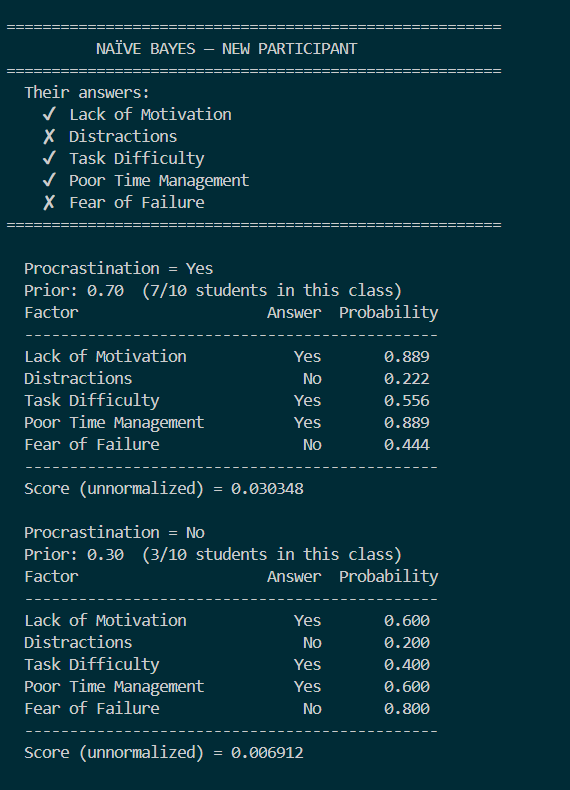
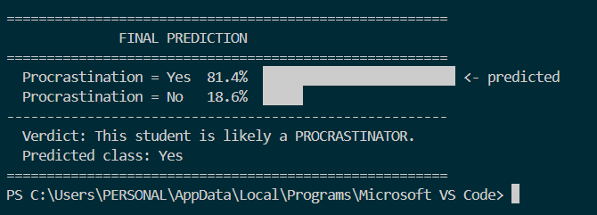

# Group-12---Procrastination-Factor-Analysis-Ghabriell-Tayong-Van-Baguio-Ivan-Arnoco

# Procrastination Factor Analysis using Naïve Bayes
# A study to determine the likelihood of a student procrastinating
# based on external factors using survey data and a Naïve Bayes classifier.
---
## Overview
This project analyzes survey responses from 10 students to identify the
most common procrastination factors and predict whether a student is likely
to procrastinate based on their answers.
The study uses two main approaches:
- Factor Analysis     — identifies which factors most commonly lead to procrastination
- Naïve Bayes         — predicts if a student is a procrastinator based on their answers
---
## Graphs

---
## Dataset
10 student responses across 5 procrastination factors. Each answer is Yes or No.
| Factor                 | Possible Values |
|------------------------|-----------------|
| Lack of Motivation     | Yes, No         |
| Distractions           | Yes, No         |
| Task Difficulty        | Yes, No         |
| Poor Time Management   | Yes, No         |
| Fear of Failure        | Yes, No         |
Class labels:
- Yes — Procrastinator        (7 out of 10 students)
- No  — Not a procrastinator  (3 out of 10 students)
---
## How It Works
Part 1 — Factor Analysis
Counts how many students said Yes to each factor and calculates
the probability of each factor. Sorted from most to least common.
Part 2 — Naïve Bayes Classifier
1. Calculates prior probabilities      — 70% procrastinators, 30% non-procrastinators
2. Calculates conditional probabilities  — how likely each answer is per class
3. Multiplies all probabilities together to get a score per class
4. Normalizes scores into final percentages
Part 3 — Final Prediction
Compares the two class scores and predicts the most likely classification
with a confidence percentage.
---
## Results

Most dominant procrastination factors found in the study:
- Lack of Motivation     9/10 students  (90%)
- Distractions           9/10 students  (90%)
- Poor Time Management   9/10 students  (90%)
- Task Difficulty        5/10 students  (50%)
- Fear of Failure        4/10 students  (40%)
---
## Requirements
pip install matplotlib
---
## How to Run
python main.py