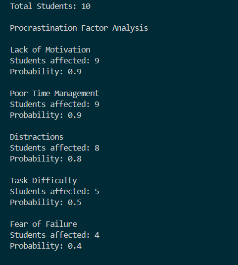
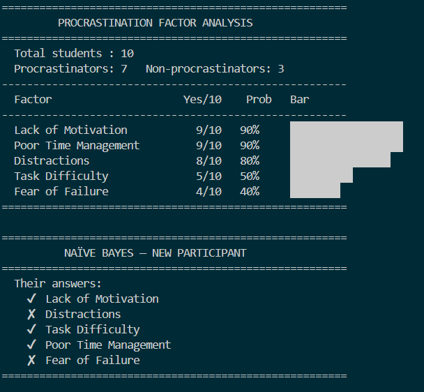
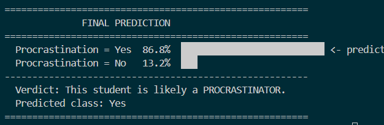

# Group-12---Procrastination-Factor-Analysis-Ghabriell-Tayong-Van-Baguio-Ivan-Arnoco

Procrastination Factor Analysis using Naïve Bayes
A study to determine the likelihood of a student procrastinating
based on external factors using survey data and a Naïve Bayes classifier.
---
## Overview
This project analyzes survey responses from 10 students to identify the
most common procrastination factors and predict whether a student is likely
to procrastinate based on their answers.
The study uses two main approaches:
- Factor Analysis     — identifies which factors most commonly lead to procrastination
- Naïve Bayes         — predicts if a student is a procrastinator based on their answers
---
## Graphs

---

## Survey Questions
| # | Factor | Question |
|---|---|---|
| 1 | Lack of Motivation | Do you delay starting tasks when you feel unmotivated? |
| 2 | Distractions | Do distractions like your phone or social media cause you to postpone tasks? |
| 3 | Task Difficulty | Do you procrastinate when a task seems too difficult? |
| 4 | Poor Time Management | Do you delay tasks because you feel you still have plenty of time? |
| 5 | Fear of Failure | Do you avoid starting tasks because you are worried you might not do them well? |

---

## Dataset
10 student responses across 5 procrastination factors. Each answer is Yes or No.
| Factor                 | Possible Values |
|------------------------|-----------------|
| Lack of Motivation     | Yes, No         |
| Distractions           | Yes, No         |
| Task Difficulty        | Yes, No         |
| Poor Time Management   | Yes, No         |
| Fear of Failure        | Yes, No         |
Class labels:
- Yes — Procrastinator        (7 out of 10 students)
- No  — Not a procrastinator  (3 out of 10 students)

| # | Timestamp | Motivation | Distractions | Difficulty | Time Mgmt | Fear | 
|---|---|---|---|---|---|---|
| 1 | 3/15/2026 12:41 | Yes | No  | No  | Yes | No  |
| 2 | 3/15/2026 12:50 | Yes | Yes | Yes | Yes | No  |
| 3 | 3/15/2026 12:51 | Yes | Yes | Yes | Yes | Yes |
| 4 | 3/15/2026 13:24 | Yes | Yes | Yes | Yes | Yes |
| 5 | 3/15/2026 13:59 | Yes | Yes | Yes | Yes | Yes |
| 6 | 3/15/2026 14:06 | Yes | No  | No  | Yes | No  |
| 7 | 3/15/2026 14:29 | Yes | Yes | No  | Yes | Yes |
| 8 | 3/15/2026 14:42 | No  | Yes | No  | No  | No  |
| 9 | 3/15/2026 14:54 | Yes | Yes | Yes | Yes | No  |
| 10 | 3/15/2026 15:14 | Yes | Yes | No  | Yes | No  |

---
## How It Works
Part 1 — Factor Analysis
Counts how many students said Yes to each factor and calculates
the probability of each factor. Sorted from most to least common.

| Factor | Count | Probability |
|---|---|---|
| Lack of Motivation | 9/10 | 90% |
| Poor Time Management | 9/10 | 90% |
| Distractions | 8/10 | 80% |
| Task Difficulty | 5/10 | 50% |
| Fear of Failure | 4/10 | 40% |

Part 2 — Naïve Bayes Classifier
Compares a new student's answers against two groups:
- **Procrastinators** — 7 out of 10 students
- **Non-Procrastinators** — 3 out of 10 students

For each group, it calculates:
- **Prior Probability** — the base chance of belonging to that group
- **Conditional Probability** — how likely each answer is within that group

All probabilities are multiplied together to produce a final score
for each group.

Part 3 — Final Prediction
Compares a new student's answers against two groups:
- **Procrastinators** — 7 out of 10 students
- **Non-Procrastinators** — 3 out of 10 students

For each group, it calculates:
- **Prior Probability** — the base chance of belonging to that group
- **Conditional Probability** — how likely each answer is within that group

All probabilities are multiplied together to produce a final score
for each group.

---
## Results

Most dominant procrastination factors found in the study:
- Lack of Motivation     9/10 students  (90%)
- Distractions           8/10 students  (80%)
- Poor Time Management   9/10 students  (90%)
- Task Difficulty        5/10 students  (50%)
- Fear of Failure        4/10 students  (40%)
---

## Results
The findings show that **Lack of Motivation** and **Poor Time Management**
are the most dominant procrastination factors, each affecting 9 out of 10
students. The Naïve Bayes classifier predicted procrastination tendency
with **81.4% confidence**.

---
## Requirements
pip install matplotlib
---
## How to Run
python main.py